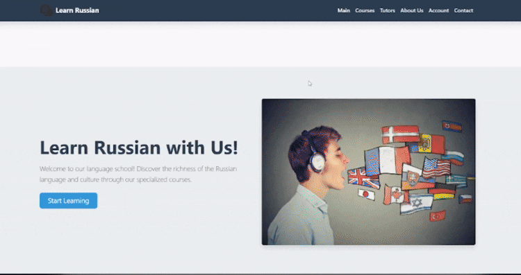

# Экзамен "Основы веб технологий"
Экзаменационная работа по предмету "Основы веб технологий" второго курса.  
Сайт размещен по [ссылке](https://w0drs.github.io/WebExam/).

## 🛠 Требования
Для успешного выполнения работы требовалось:  
1. Создание и настройка проекта
- Сделать репозиторий на GitHub, создать папки css/scripts, файлы index.html, dashboard.html, настроить Git
- Получить API-ключ из СДО (без него ничего работать не будет)
2. Верстка главной страницы
- Сверстать шапку, футер, блоки с курсами и репетиторами на Bootstrap 5.3
- Сделать адаптивную сетку, формы поиска, модальные окна
3. Верстка личного кабинета
- Создать таблицу заказов с кнопками "Подробнее/Изменить/Удалить"
- Реализовать пагинацию (по 5 записей на странице)
4. Подключение API и JavaScript
- Написать функции для загрузки курсов, репетиторов, заявок (GET-запросы)
- Реализовать создание/редактирование/удаление заявок (POST/PUT/DELETE)
- Сделать динамический расчет стоимости в форме заявки
5. Деплой и сдача
- Загрузить проект на хостинг
- Проверить работоспособность, отправить ссылки в СДО

## 📸 Демонстрация решения

### Главная страница


### Добавление курсов и тьюторов


### Интерактивная карта


## 📄 Структура проекта
```text
WebExam/
├── index.html                    # Главная
├── dashboard.html                # Личный кабинет
├── README.md                     # Описание
│
└── static/
    ├── css/
    │   └── styles.css           # Все стили тут
    ├── img/                     # Картинки, гифки
    └── scripts/
        ├── api.js               # ВСЕ функции API тут
        ├── main.js              # Скрипты главной
        ├── dashboard.js         # Скрипты кабинета
        └── map.js               # Карта
```

## ⚙️ API KEY
API ключ записан в файле [api.js](static/scripts/api.js):
```javascript
// scripts/api.js
const API_KEY = '466c3ff5-62a5-4417-9faa-d283e3c760a7';
const API_BASE_URL = 'http://exam-api-courses.std-900.ist.mospolytech.ru';
// ... остальной код
```
